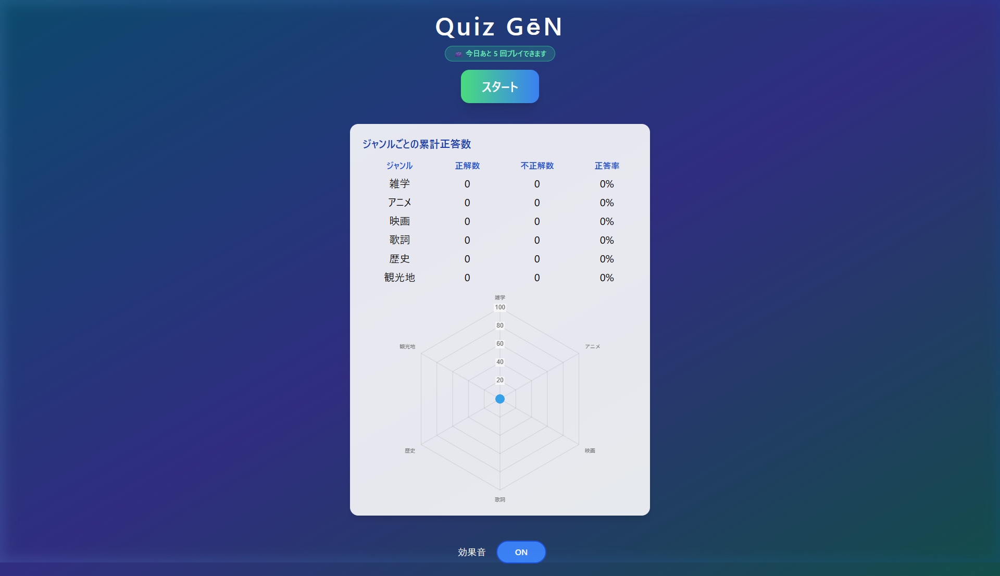
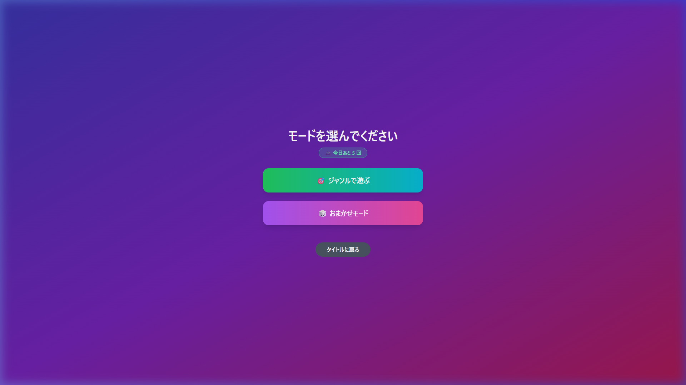
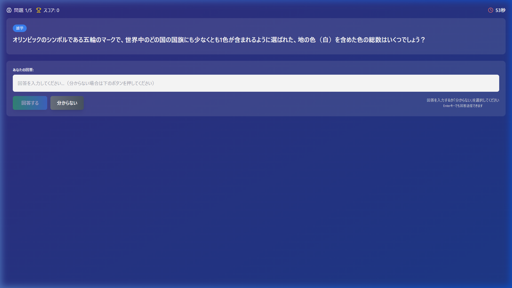

# Quiz GēN 

**Google Gemini AI がリアルタイムで問題を生成する、日本語クイズアプリです。**

[](https://react.dev/)
[](https://tailwindcss.com/)
[](https://ai.google.dev/)
[](https://vercel.com/)

🔗 **[デモを試す](https://develop-2.vercel.app)**

> ⚠️ デモ版のため、1日あたり **5回** まで無料でプレイできます。

---

##  スクリーンショット

| タイトル画面 | モード選択 | ゲーム画面 |
|:---:|:---:|:---:|
|  |  |  |
| レーダーチャートで成長記録 | ジャンル選択 / おまかせ | 60秒タイマー＋テキスト入力 |

---

##  機能一覧

| 機能 | 内容 |
|------|------|
| **AI問題生成** | Gemini AI が指定ジャンル・トピックで5問を一括生成 |
| **ジャンル選択** | 雑学・アニメ・映画・歌詞・歴史・観光地の6ジャンル |
| **カスタムトピック** | 好きなトピックを自由入力して世界に一つのクイズを生成 |
| **段階的回答判定** | 表記ゆれに対応した4段階スマート判定システム |
| **カウントダウンタイマー** | 1問60秒の制限時間 |
| **効果音** | Web Audio API による正解・不正解・タイムアップ音 |
| **ジャンル別統計** | LocalStorage に累計正解数を記録・グラフ表示 |
| **レーダーチャート** | タイトル画面でジャンル別正答率を可視化 |
| **モデル自動フォールバック** | APIが混雑時は下位モデルへ自動切り替え |

---

##  こだわった点

### 1. AI によるリアルタイム問題生成
毎回 Gemini AI が問題を生成するため、**問題が尽きることがありません**。  
カスタムトピックに「推しのアーティスト名」や「好きなゲーム」を入力すれば、好みのクイズを楽しめます。

### 2. 段階的回答判定システム（SmartJudge）

テキスト入力式クイズの課題「表記ゆれ」を4段階で解決しています。

```
段階1: 完全一致チェック（正規化後の文字列比較）
  ↓ 判定できない場合
段階2: キーワードマッチ（一致率70%以上で正解）
  ↓ 判定できない場合
段階3: 明らかな不正解チェック（空回答・型不一致）
  ↓ 判定できない場合
段階4: AI判定（Gemini が意味的な同一性を判断）
```

例：「東京都」と入力しても「東京」が正解なら ✅ 正解になります。

### 3. APIエラーへの堅牢な対応

```
APIエラー発生
  ├─ 429 / 503（過負荷）→ 指数バックオフで最大3回リトライ
  └─ 全試行失敗 → 下位モデルへ自動フォールバック

Gemini 2.5 Flash → Gemini 2.0 Flash → Gemini 1.5 Flash
```

### 4. ジャンル別成長の可視化
LocalStorage に累計戦績を保存し、タイトル画面に **レーダーチャート** で表示。  
どのジャンルが得意・苦手かが一目でわかります。

---

##  技術スタック

| カテゴリ | 技術 | 用途 |
|--------|------|------|
| **フレームワーク** | React 19 | UI・状態管理 |
| **ビルドツール** | Create React App | 開発環境 |
| **スタイリング** | Tailwind CSS v3 | UIデザイン |
| **AI** | Google Gemini API | 問題生成・回答判定 |
| **グラフ** | Chart.js / react-chartjs-2 | レーダーチャート |
| **アイコン** | Lucide React | UI アイコン |
| **音声** | Web Audio API | 効果音 |
| **データ永続化** | LocalStorage | 統計データの保存 |
| **デプロイ** | Vercel | ホスティング |

---

## 🗂️ ディレクトリ構成

```
src/
├── App.jsx                       # ルートコンポーネント・画面管理・ゲームロジック
├── components/
│   ├── TitleScreen.jsx           # タイトル・統計・レーダーチャート
│   ├── ModeSelectScreen.jsx      # モード選択（ジャンル / おまかせ）
│   ├── GenreSelection.jsx        # ジャンル選択・カスタムトピック入力
│   ├── GeneratingScreen.jsx      # 問題生成中ローディング画面
│   ├── GameScreen.jsx            # メインゲーム・タイマー・判定UI
│   ├── ResultScreen.jsx          # 結果表示・正答率
│   └── LimitModal.jsx            # 回数制限到達時のモーダル
├── services/
│   ├── enhancedGeminiService.js  # Gemini API呼び出し・一括生成・フォールバック
│   ├── smartJudgeService.js      # 段階的回答判定システム
│   └── aiJudgeService.js         # AI判定（意味的な同一性判断）
├── hooks/
│   └── useTimer.js               # タイマーカスタムフック
└── utils/
    ├── usageLimit.js             # 1日5回の利用制限管理
    └── gameLogic.js              # ゲームロジックユーティリティ
```

---

## 🚀 ローカルでの実行方法

```bash
# リポジトリをクローン
git clone https://github.com/G023C1049/Quiz_Gen.git
cd Quiz_Gen

# 依存パッケージをインストール
npm install

# 環境変数ファイルを作成
echo REACT_APP_GEMINI_API_KEY=your_api_key_here > .env

# 開発サーバーを起動
npm start
```


---

##  苦労した点

**回答判定の精度**  
テキスト入力式は「○○市」「○○（人名）」など表記が多様なため、単純な文字列比較では誤判定が多発。キーワード抽出・正規化・AI判定を組み合わせることで解決しました。

**AI出力のJSONパース**  
Gemini の返答が常に正しいJSON形式ではなく、マークダウンのコードブロックで囲まれることも。正規表現で柔軟にJSONを抽出する処理を実装しました。

**環境変数の扱い**  
Create React App の `REACT_APP_` プレフィックスのルールを理解し、Vercel 側の環境変数設定と `.gitignore` による APIキー漏洩防止を習得しました。

---

## 📊 今後の改善案

- [ ] バックエンド経由でのAPIキーのサーバーサイド管理
- [ ] 難易度選択（easy / medium / hard）
- [ ] 問題履歴・復習モード
- [ ] オンラインランキング機能
- [ ] PWA対応（オフラインプレイ）
- [ ] マルチプレイヤー機能の実装

---

## 📄 ライセンス

MIT License
